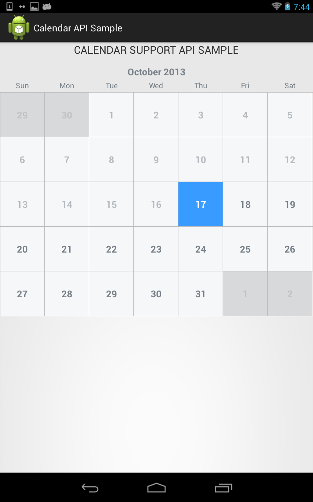
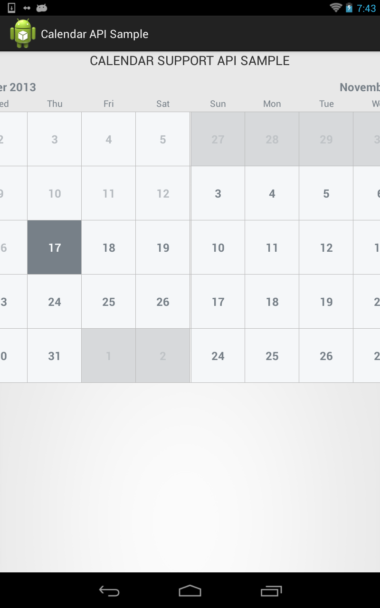

Calendar Support Library for Android
==========================

A calendar view widget for picking dates.
Adapted from TimesSquare for Android, implemented using ViewPagers





Usage
-----

Include `CalendarViewPager` in your layout XML.

```xml
<com.collegewires.api.calendar.CalendarViewPager
            android:id="@+id/calendar_view"
            android:layout_width="wrap_content"
            android:layout_height="wrap_content"
            android:background="@android:color/transparent" >
```

In the `onCreate` of your activity/dialog or the `onCreateView` of your fragment, initialize the
view with a starting date (e.g. today). The widget shows months upto Year 2099.

```java
Calendar today = Calendar.getInstance();
		
		calendarViewPager = (CalendarViewPager) findViewById(R.id.calendar_view);
		
		calendarViewPager.initialize(this).minDate(today.getTime())
						.selectionMode(SelectionMode.SINGLE).create();
```

The default mode of the view is to have one selectable date (`SelectionMode.SINGLE`).  If you want the user to be able to
select multiple dates or a date range, use the `selectionMode()` method and `SelectionMode.MULTIPLE` or `SelectionMode.RANGE` as argument:

Download
--------

The latest version can be downloaded in [zip][zip] and referenced by your application as a library
project.

License
-------

    Copyright 2013 Hrishikesh Kumar.

    Licensed under the Apache License, Version 2.0 (the "License");
    you may not use this file except in compliance with the License.
    You may obtain a copy of the License at

       http://www.apache.org/licenses/LICENSE-2.0

    Unless required by applicable law or agreed to in writing, software
    distributed under the License is distributed on an "AS IS" BASIS,
    WITHOUT WARRANTIES OR CONDITIONS OF ANY KIND, either express or implied.
    See the License for the specific language governing permissions and
    limitations under the License.


 [zip]: https://github.com/hshed/android-calendar-support/archive/master.zip
